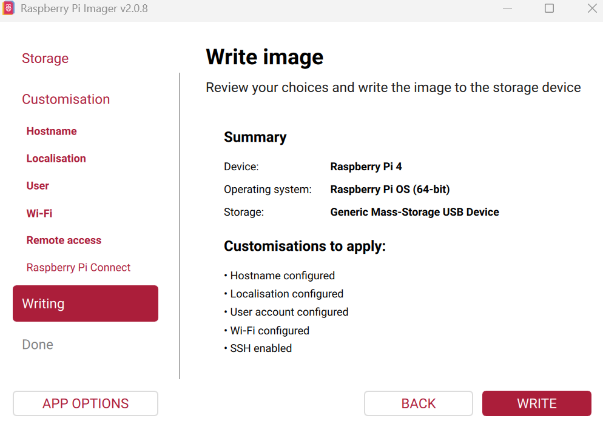

> See ../Z_SelfHosting/Frigate for the updated pi camera working as per a [newer May 2026 blog post](https://jalcocert.github.io/JAlcocerT/plants-103-inspiration/#monitoring-plants-while-travelling)

* Further **info** at::
	* https://jalcocert.github.io/JAlcocerT/blog/tinker-rpi-cv/
	* https://github.com/JAlcocerT/rpi-mjpg-streamer
	( https://jalcocert.github.io/JAlcocerT/raspberry-pi-camera-setup/)
	* Related to [DJI Cam Drone](https://jalcocert.github.io/JAlcocerT/dji-tello-python-programming/)

```sh
git clone https://github.com/meinside/rpi-mjpg-streamer #https://github.com/JAlcocerT/rpi-mjpg-streamer
cd rpi-mjpg-streamer
```

Build the image:

```sh
sudo docker build -t streamer:latest \
		--build-arg PORT=9999 \
		--build-arg RESOLUTION=400x300 \
		--build-arg FPS=24 \
		--build-arg ANGLE=0 \
		--build-arg FLIPPED=false \
		--build-arg MIRRORED=false \
		--build-arg USERNAME=user \
		--build-arg PASSWORD=some-password \
		.
```

Deploy the image:

```sh
docker run -p 9999:9999 --device /dev/video0 -it streamer:latest
```


---

## Pre-Requisites

Get a Rpi and [install the OS](https://github.com/raspberrypi/rpi-imager/releases/tag/v2.0.8) and docker:

```sh
choco install rpi-imager
```



I2C has to be enabled!


---


cat security-audit.md 
# Raspberry Pi Security Hardening Audit

**System:** Debian 13 (trixie) | **User:** jalcocert | **Date:** 2026-05-07

| Measure | Status |
|---|---|
| Default `pi` user removed | ✅ Done |
| Named user (`jalcocert`) in use | ✅ Done |
| SSH service active | ✅ Active (port 22) |
| Root login disabled | ⚠️ Not explicit — defaults to `prohibit-password` |
| Password authentication disabled | ❌ Not set |
| SSH key-only auth | ❌ Not configured |
| SSH port changed from 22 | ❌ No |
| fail2ban installed | ❌ Not installed |
| UFW firewall | ❌ Not installed |
| AppArmor enforced | ❌ Module loaded, no profiles active |
| unattended-upgrades | ✅ Installed |
| Read-only filesystem | ❌ `rw` |
| Bluetooth disabled | ❌ Still active |
| WiFi disabled | ❌ Not configured |
| X11 forwarding disabled | ❌ Enabled (unnecessary for headless) |
| USB gadgets restricted | ✅ No gadget config found |
| Recent system update | ✅ Updated 2026-05-07 |

## Additional Findings

| Measure | Status |
|---|---|
| `/tmp` hardened (nosuid,nodev) | ✅ Done (tmpfs) |
| `/tmp` noexec | ❌ Not set |
| Kernel: accept_redirects=0 | ✅ Done |
| Kernel: send_redirects=0 | ❌ Currently `1` (non-router should disable) |
| Kernel: secure_redirects=0 | ❌ Currently `1` |
| Kernel: rp_filter=1 | ❌ Currently `0` |
| Kernel: tcp_syncookies=1 | ✅ Done |
| Kernel: accept_source_route=0 | ✅ Done |
| Kernel: kptr_restrict, dmesg_restrict, ptrace_scope hardened | ❌ Likely defaults |
| Exposed services on `0.0.0.0` | ⚠️ Ports 3000, 5000, 111, 8654 open |
| Reverse proxy (TLS) | ❌ Services exposed directly |
| Docker installed | ⚠️ Check user namespaces, rootless mode, socket permissions |
| Password policy (pwquality) | ❌ Not configured |
| Cron restricted (cron.allow) | ❌ No `/etc/cron.allow` |
| journald size limit | ❌ Defaults (no `SystemMaxUse`) |
| auditd installed | ❌ Not installed |
| Swap | ✅ zram (encrypted in-memory) |
| Sudoers NOPASSWD | ✅ No risky entries found |

## Recommended Next Steps

### Immediate

```bash
# 1. Install and configure UFW
apt install ufw
ufw default deny incoming
ufw default allow outgoing
ufw allow 22/tcp
ufw enable

# 2. Install fail2ban
apt install fail2ban

# 3. Harden SSH (/etc/ssh/sshd_config)
PermitRootLogin no
PasswordAuthentication no
PubkeyAuthentication yes
X11Forwarding no
Port 22   # or change to a non-standard port

# 4. Disable Bluetooth
echo "dtoverlay=disable-bt" >> /boot/config.txt

# 5. Network hardening (/etc/sysctl.d/99-hardening.conf)
net.ipv4.conf.all.send_redirects = 0
net.ipv4.conf.default.send_redirects = 0
net.ipv4.conf.all.secure_redirects = 0
net.ipv4.conf.default.secure_redirects = 0
net.ipv4.conf.all.rp_filter = 1
net.ipv4.conf.default.rp_filter = 1
net.ipv4.conf.all.accept_redirects = 0
net.ipv4.conf.default.accept_redirects = 0
kernel.kptr_restrict = 2
kernel.dmesg_restrict = 1
kernel.yama.ptrace_scope = 2
kernel.sysrq = 0

# 6. Noexec on /tmp (add to /etc/fstab)
# tmpfs /tmp tmpfs rw,nosuid,nodev,noexec 0 0
```

### Operational

```bash
# 7. Put exposed services behind a reverse proxy (nginx/caddy) with TLS
#    or bind them to 127.0.0.1 if external access isn't needed

# 8. Docker security
#    - Enable user namespaces: --userns-remap=default in /etc/docker/daemon.json
#    - Audit docker group membership
#    - Consider rootless mode

# 9. Password policy
apt install libpam-pwquality
# then configure /etc/pam.d/common-password

# 10. Restrict cron
echo "root" > /etc/cron.allow
echo "jalcocert" > /etc/cron.allow

# 11. Limit journald (/etc/systemd/journald.conf)
SystemMaxUse=100M

# 12. Install auditd
apt install auditd

# 13. Investigate listening services on ports 111, 8654
ss -tlnp | grep -E "111|8654"
```

### Maintenance

- Reboot after config changes
- Run `sysctl -p` to apply kernel params immediately
- Review Docker containers for unnecessary exposure
- Set up log shipping or logwatch for anomaly detection
