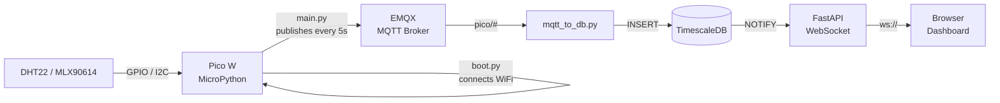
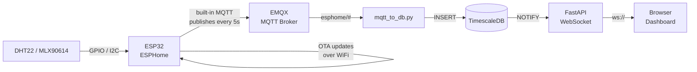

# ESPHome

ESPHome is a firmware framework for ESP32/ESP8266 devices. Instead of writing MicroPython, you describe the device behaviour in YAML and ESPHome generates and flashes the firmware for you.

## Start

```sh
docker compose up -d
```

Dashboard at `http://192.168.1.2:6052`

> `network_mode: host` is required for mDNS device discovery and OTA (over-the-air) flashing to work on the local network.

## How it relates to this project

| Pico W (MicroPython) | ESP32 (ESPHome) |
|---|---|
| Write Python code manually | Describe sensors in YAML |
| Flash via USB + Thonny | Flash via USB once, then OTA |
| MQTT via `umqtt` | MQTT built-in, one config line |
| Manual error handling | ESPHome handles reconnects |

## DHT22 example config

Save as `config/dht22-sensor.yaml`:

```yaml
esphome:
  name: dht22-sensor

esp32:
  board: esp32dev

wifi:
  ssid: "your-wifi"
  password: "your-password"

mqtt:
  broker: 192.168.1.2
  topic_prefix: esphome/dht22

sensor:
  - platform: dht
    pin: GPIO15
    model: DHT22
    temperature:
      name: "DHT22 Temperature"
    humidity:
      name: "DHT22 Humidity"
    update_interval: 5s
```

## MLX90614 example config

Save as `config/mlx90614-sensor.yaml`:

```yaml
esphome:
  name: mlx90614-sensor

esp32:
  board: esp32dev

wifi:
  ssid: "your-wifi"
  password: "your-password"

mqtt:
  broker: 192.168.1.2
  topic_prefix: esphome/mlx90614

i2c:
  sda: GPIO8
  scl: GPIO9

sensor:
  - platform: mlx90614
    ambient:
      name: "MLX90614 Ambient"
    object:
      name: "MLX90614 Object"
    update_interval: 5s
```

## First flash (USB), then OTA

```sh
# First time: connect ESP32 via USB and flash from the dashboard
# After that: all updates are sent over WiFi (OTA) — no USB needed
```

## Workflows

**Pico W + MicroPython**



**ESP32 + ESPHome**


