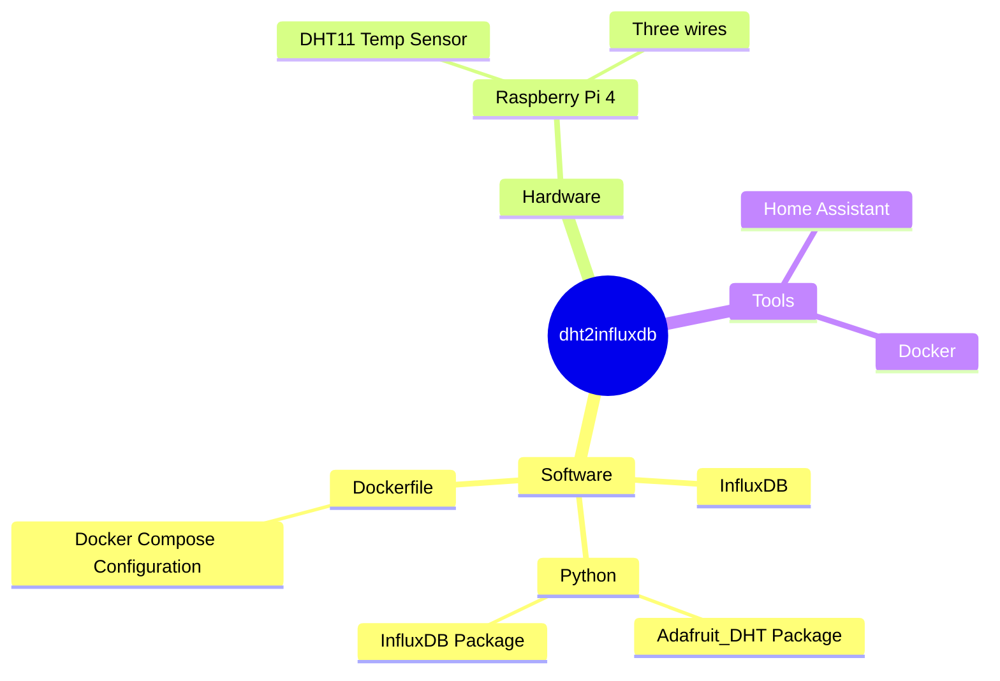

We are going to read **Temperature and Humidity** data from the **DHT11** sensor, save it into an **InfluxDB** (*say Hi to time-series DBs*).

With that, you can feed the DHT [sensor information to Home Assistant](#how-can-i-install-home-assistant) and let go your imagination.

All of this with docker as well?

Yes, let's put everything together and create a **[reliable Stack](https://github.com/JAlcocerT/RPi/blob/main/Z_IoT/DHT11-to-InfluxDB/DHT11HomeAssistant-Stack.yml)** that we can share across any other RPi and forget about dependencies.

You can also use **this project with [HA](#how-can-i-install-home-assistant)** as well!

Lets get to work.

>  All the code/configurations are in this post and the [related source code](https://github.com/JAlcocerT/RPi/tree/main/Z_IoT/DHT11-to-InfluxDB) 👇
{: .prompt-info }

## Before Starting

- [ ] Send DHT Data to InfluxDB
  + [x] Hardware Check
  + [ ] Python [Script](#the-base-code-python-with-dht11)
  + [ ] The Database: [InfluxDB](#pushing-data-from-python-to-influxdb)
- [ ] Connect InfluxDB with DHT11 Data to **Home Assistant** (optional)

If you already have a RPi at home and a DHT11 sensor, you can perfectly **get started** with this project.


| Hardware             | Code                  | Data Analytics Stack |
|---------------------|:---------------------------------:|:-----------:|
| `Raspberry Pi 4`  ✓  | Python           | InfluxDB        |
| `DHT11`     ✓  | Dockerfile    | HomeAssistant with InfluxDB Integration        |
| `Wires`        ✓      | Docker-compose Stack   | Docker Container  |

This is **a [MermaidJS](https://jalcocert.github.io/JAlcocerT/ai-useful-yet-simple/#diagrams-with-ai) Mindmap** of this IoT Project.




> Use **Raspberry Pi 32/64 bits** running [Raspbian GNU/Linux 11 (**bullseye**)](https://archive.raspberrypi.org/debian/dists/) for this project.
{: .prompt-info }

* Make sure you have Python ready: `python --version` - I used 3.9.2
* And also pip `pip --version` - For me it was 20.3.4
* Check your Linux version with: `uname -a` - I used kernel 6.1
* And make sure that you use Bullseye (I was getting error with DHT_Adafruit Installation in the newer v12 Bookworm)
* (Optional) - `docker info` ->   buildx: Docker Buildx (Docker Inc., v0.15.1) and compose: Docker Compose (Docker Inc., v2.28.1)

### The Sensor: DHT11

Temperature and Humidity Data.


| Pins             | Description                  |
|---------------------|:---------------------------------:|
| `+`     | Connect 5V or 3.3V           | 
| `data`       | Temp and Humidity data will be flowing here    |
| `-`             | Ground (0V)   |

#### Connecting a DHT11 to a Raspberry Pi 4

To connect the sensor to the Raspberry, you can follow this schema:

{: width="972" height="589" }
_DHT11 connection to a Raspberry Pi 4_

I prefer to use the **3.3V for the DHT11**, and yet it will work perfectly with 5V as well.

> In the [RPi Official web](https://www.raspberrypi.com/documentation/computers/raspberry-pi.html) you can find the original **GPIO schema**. 
{: .prompt-info }

You can always go to the terminal and check with:
```sh
pinout
```

### Why InfluxDB?

* Performance: InfluxDB is designed to store and query **time-series data** quickly.
* Scalability: InfluxDB can scale to handle large amounts of data. 
* Reliability: InfluxDB is a reliable database that is designed to keep your data safe. 

And...InfluxDB is free and [open source](https://github.com/influxdata/influxdb)

## The Base Code: Python with DHT11

Execute this code (it prints the values as well) to know that everything works for you, or just go to the next step point.

> Credits to [thegeekpub](https://www.thegeekpub.com/236867/using-the-dht11-temperature-sensor-with-the-raspberry-pi/) for the initial scheleton of the code.
{: .prompt-tip }

I have adapted it so that instead of printing the values, it will push the Temperature and Humidity to an InfluxDB that we are going to self-host as well.

* We need to install the [Adafruit_DHT](https://github.com/adafruit/Adafruit_Blinka) library:

```py
pip install Adafruit_DHT
```

* And the library for the InfluxDB connection:

```py
pip install influxdb
#pip show influxdb
```

* [This code](https://github.com/JAlcocerT/RPi/tree/main/Z_IoT/DHT11-to-InfluxDB) will test that we get data and the the connections are working: `Python_DHT11_Test.py`


```py
import Adafruit_DHT
import time
from influxdb import InfluxDBClient

DHT_SENSOR = Adafruit_DHT.DHT11
DHT_PIN = 4

# Configure InfluxDB connection
#influx_client = InfluxDBClient(host='influxdb', port=8086)

# Try to create the database, or use it if it already exists
# database_name = 'sensor_data'
# existing_databases = influx_client.get_list_database()

# if {'name': database_name} not in existing_databases:
#     influx_client.create_database(database_name)
#     print(f"Database '{database_name}' created.")

#influx_client.switch_database(database_name)

while True:
    humidity, temperature = Adafruit_DHT.read(DHT_SENSOR, DHT_PIN)
    if humidity is not None and temperature is not None:
        # data = [
        #     {
        #         "measurement": "dht_sensor",
        #         "tags": {},
        #         "time": time.strftime('%Y-%m-%dT%H:%M:%SZ'),
        #         "fields": {
        #             "temperature": temperature,
        #             "humidity": humidity
        #         }
        #     }
        # ]
        # influx_client.write_points(data)
        print("Data sent to InfluxDB:",humidity," ",temperature)
    else:
        print("Sensor failure. Check wiring.")
    time.sleep(3)
```

You can also check (uncommenting the influxDB part) if a local instance of the DB is recognizing the input data.

## Pushing Data from Python to InfluxDB

The [Python code](https://github.com/JAlcocerT/RPi/blob/main/Z_IoT/DHT11-to-InfluxDB/Python2InfluxDB.py) and the InfluxDB can be running directly in our Raspberry Pi, but I prefer to use Docker containers when possible to isolate dependencies and make the projects more resilient and easier to debug.

* We will be using these base containers:
    * The image to have our own **InfluxDB in a container**: <https://hub.docker.com/_/influxdb/tags>
    * I have used this **Python base image** to create a container with the code: <https://hub.docker.com/_/python>

### The artifacts we need

1. The [Python Code](#the-base-code-python-with-dht11) - We just saw how to
2. Now: Create an instance of the **InfluxDB with Docker** and this Docker-Compose:

```yml
version: '3'
services:

  influxdb:
    image: influxdb:1.8 #v1.8 works for ARM32 #latest for ARM64 only
    container_name: influxdb
    ports:
      - "8086:8086"
    volumes:
      - influxdb_data:/var/lib/influxdb
    environment:
      - INFLUXDB_DB=sensor_data
      - INFLUXDB_ADMIN_USER=your_password
      - INFLUXDB_ADMIN_PASSWORD=change_me_please

volumes:
  influxdb_data:
```

Once InfluxDB is deployed, you can try to ping with:

```sh
curl -I http://127.0.0.1:8086/ping #if running locally
```

We have 2 options for this to work:

* Option 1: Use the adjusted [Python code](https://github.com/JAlcocerT/RPi/blob/main/Z_IoT/DHT11-to-InfluxDB/Python2InfluxDB.py)
* Option 2: Use the [Docker-Compose](https://github.com/JAlcocerT/RPi/blob/main/Z_IoT/DHT11-to-InfluxDB/Python2InfluxDB-Stack.yml) Stack to Deploy with Docker the Python Code.
    * The docker image that isolates all of this and allow us to deploy easier: <https://hub.docker.com/r/fossengineer/iot/tags>
        * The tag is: dht11_sensor_to_influxdb
* Option 2b: optional, just if you want to replicate the docker build process of my container
    * The [Dockerfile](https://github.com/JAlcocerT/RPi/blob/main/Z_IoT/DHT11-to-InfluxDB/Dockerfile)


### Quick Setup

You have everything connected and want just a quick setup? Simply use this [docker-compose](https://github.com/JAlcocerT/RPi/blob/main/Z_IoT/DHT11-to-InfluxDB/Python2InfluxDB-Stack.yml) below:

1. `git clone https://github.com/JAlcocerT/RPi`
2. `cd ./RPi/Z_IoT/DHT11-to-InfluxDB`
3. Build the Docker Image: `docker build -t dht11_python_to_influxdb .`
4. Use the Docker-Compose below:
* With CLI: `docker-compose -f Python2InfluxDB-Stack.yml up -d`
* Or as a [Portainer Stack](https://jalcocert.github.io/RPi/posts/selfhosting-with-docker/#installing-portainer) with GUI

```yml
version: "3"
services:

  python_dht:
    container_name: python_dht
    image: dht11_python_to_influxdb #fossengineer/dht11_python_to_influxdb  # Use the name of your pre-built Python image
    privileged: true
    environment:
      - INFLUXDB_HOST=influxdb
      - INFLUXDB_PORT=8086
      - INFLUXDB_DBNAME=sensor_data
      - INFLUXDB_USER=admin
      - INFLUXDB_PASSWORD=mysecretpassword
    command: ["python", "your_python_script.py"]

    depends_on:
      - influxdb

  influxdb: #this is running in other device, so make sure that the container is running before executing the python one
    image: influxdb:1.8 #latest (for ARM64 only)
    environment:
      - INFLUXDB_DB=sensor_data
      - INFLUXDB_ADMIN_USER=admin
      - INFLUXDB_ADMIN_PASSWORD=adminpass
      - INFLUXDB_USER=user
      - INFLUXDB_USER_PASSWORD=userpass    
```

## Displaying DHT11 Data on Dashboards

For visualizations there are several tools out there.

* **Option 1** - With Grafana: Connect the InfluxDB to Grafana as a Data Source

Grafana is not only good [for monitoring](https://jalcocert.github.io/RPi/posts/selfh-grafana-monit/), but also we can display IoT Data:

```yml

version: '3'
services:
  dht_sensor_app:
    image: dht_sensor_app_influxdb
    container_name: dht_sensor_app
    privileged: true
    depends_on:
      - influxdb

  influxdb:
    image: influxdb:1.8 #for arm32/64 #latest for ARM64
    container_name: influxdb
    ports:
      - "8086:8086"
    volumes:
      - influxdb_data:/var/lib/influxdb
    environment:
      - INFLUXDB_DB=sensor_data
      - INFLUXDB_ADMIN_USER=admin
      - INFLUXDB_ADMIN_PASSWORD=mysecretpassword

  grafana:
    image: grafana/grafana:9.5.7 #was using this one instead of latest for stability
    container_name: grafana
    ports:
      - "3000:3000"
    depends_on:
      - influxdb
    volumes:
      - grafana_data:/var/lib/grafana  # Add this line to specify the volume

volumes:
  influxdb_data:
  grafana_data:  # Define the volume for Grafana
```

* [Grafana Configuration](https://github.com/JAlcocerT/Docker/tree/main/IoT/Grafana) with InfluxDB
  * To access Grafana, you will need the creds: `admin/admin`
  * Then add your first data source -> InfluxDB - Input the Databse name / User / Password as defined in the docker compose configuration.
  * Dont forget to add the http url of our influxDB as: `http://192.168.3.130:8086` (Local IP of your RPI / The Container IP)

* **Option 2** - With [Home Assistant](#how-can-i-install-home-assistant)

* **Option 3** - With Chronograph - https://github.com/influxdata/chronograf?tab=License-1-ov-file#readme


---

## FAQ

### Quick Test

1. `git clone https://github.com/JAlcocerT/RPi`
2. `cd ./RPi/Z_IoT/DHT11-to-InfluxDB`
3. Create a [Python venv](https://fossengineer.com/python-dependencies-for-ai/#venvs)

```sh
python -m venv dhtinflux
```

4. Activate the Python environment: `python -m venv dhtinflux`
5. Install the dependencies: `pip install -r requirements.txt`
5. Execute the Sample Code to check Wirings/ Sensor are Fine `python`


### How can I Query InfluxDBs with SQL?


If you go **inside the InfluxDB container**, you can execute the following to check that everything is working as it should: `docker exec -it influxdb /bin/bash`

```sh
influx
show databases
use sensor_data
show measurements #here we will have the dht_sensor Data that Python is Pushing
```

Then, query your InfluxDB with:

```sql
SELECT * FROM dht_sensor
SELECT * FROM dht_sensor ORDER BY time DESC LIMIT 10
```

### How can I install Home Assistant?

InfluxBD plays great with Home Assistant, you can spin HA with this [Docker-Compose](https://github.com/JAlcocerT/RPi/blob/main/Z_IoT/DHT11-to-InfluxDB/DHT11HomeAssistant-Stack.yml):

```yml
version: "2.1"
services:
  homeassistant:
    image: lscr.io/linuxserver/homeassistant:latest
    container_name: homeassistant
    network_mode: host
    environment:
      - PUID=1000
      - PGID=1000
      - TZ=Europe/Rome
    volumes:
      - ~/Docker/HomeAssistant:/config
    ports:
      - 8123:8123 #optional
    #devices:
    #  - /path/to/device:/path/to/device #optional
    restart: unless-stopped
```

*You can also install [HA as an OS](https://www.home-assistant.io/installation/raspberrypi) in a RaspberryPi*

> The container will be exposed on port 8123, so you can access the Home Assistant web interface at `http://localhost:8123`
{: .prompt-info }

### Integrating Home Assistant with InfluxDB

We can try: Settings - Devices and Services -> [Add Integration -> InfluxDB](https://www.home-assistant.io/integrations/influxdb)

But in the latest versions of HA, you will get 'This device cannot be added from the UI'.

Acces the HA container -> cd config -> cat configuration.yaml and you will have a look of its current content. We are going to modify with: vi configuration.yaml

Make it look like this one below (we are adding our influxDB credentials):

```yml
default_config:

# Load frontend themes from the themes folder
frontend:
  themes: !include_dir_merge_named themes

automation: !include automations.yaml
script: !include scripts.yaml
scene: !include scenes.yaml

influxdb:
  host: YOUR_INFLUXDB_HOST
  port: YOUR_INFLUXDB_PORT
  username: YOUR_INFLUXDB_USERNAME
  password: YOUR_INFLUXDB_PASSWORD
  database: YOUR_INFLUXDB_DATABASE #sensor_data
```
{: file='configuration.yml'}


> To apply: Esc + :w to save Esc + :q to exit
{: .prompt-info }


#### Why priviledge flag?

The container needs access to the GPIO port, otherwise, you will observe this error in the container:


```sh
Traceback (most recent call last):

  File "dht11_python_timescale.py", line 34, in <module>

    humidity, temperature = Adafruit_DHT.read(DHT_SENSOR, DHT_PIN)

  File "/usr/local/lib/python3.8/site-packages/Adafruit_DHT/common.py", line 81, in read

    return platform.read(sensor, pin)

  File "/usr/local/lib/python3.8/site-packages/Adafruit_DHT/Raspberry_Pi_2.py", line 34, in read

    raise RuntimeError('Error accessing GPIO.')

RuntimeError: Error accessing GPIO.
```

### More about HA

#### HA Integrations

You can check more HA integrations in the [official page](https://www.home-assistant.io/integrations/).

We have used the [InfluxDB integration](https://www.home-assistant.io/integrations/influxdb/) in this post, but there are [much more](https://analytics.home-assistant.io/integrations/):

* ESPHome: <https://www.home-assistant.io/integrations/esphome>
* Zigbee: <https://www.home-assistant.io/integrations/zha>
* MQTT: <https://www.home-assistant.io/integrations/mqtt/>

* <https://www.home-assistant.io/docs/automation/trigger/#webhook-trigger>

* <https://www.home-assistant.io/integrations/openweathermap>
* <https://www.home-assistant.io/integrations/forecast_solar>

* Syncthing: <https://www.home-assistant.io/integrations/syncthing/>
* <https://www.home-assistant.io/integrations/qbittorrent/>
* <https://www.home-assistant.io/integrations/sonarr/>
* <https://www.home-assistant.io/integrations/transmission/>

* <https://www.home-assistant.io/integrations/upnp>

* Smart Home devices: <https://www.home-assistant.io/integrations/tplink/>

* Torque: <https://www.home-assistant.io/integrations/torque/>
  * Engine Performance & Diagnostic: <https://torque-bhp.com/>
* Crypto: <https://www.home-assistant.io/integrations/etherscan/>

> When buyind Iot devices, check that their integration is [classified as local push or local polling](https://www.home-assistant.io/blog/2016/02/12/classifying-the-internet-of-things/#classifiers) to avoid dependencies with 3rd Party clouds.

* You might be interested to look for **[Tasmota compatible devices](https://templates.blakadder.com/sensors.html)** *- a firmware for micro-controllers*.
* Or to any device compatible with **[ESPHome](https://devices.esphome.io/)**
* Also, **Zegbee** will be useful: <https://www.zigbee2mqtt.io/>

Both are great to create a fully local IoT Home.
{: .prompt-info }

#### HACS - Non Official Integrations

You can find them here: <https://hacs.xyz/>

#### HA add-ons

[HA Add-ons](https://www.home-assistant.io/addons/) are different concept than integrations.

Check them here: <https://community.home-assistant.io/tag/hassio-repository>

> Remember that **Add-ons are only available** if you've used the **Home Assistant Operating System** or Home Assistant Supervised installation method. 
{: .prompt-info }